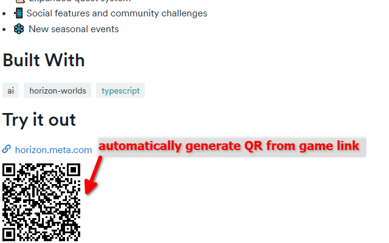

# Devpost Meta Horizon QR

A Chrome extension that automatically generates and displays a QR code for "Try it out" links (specifically Meta Horizon World links) on Devpost project pages. This makes it easy to open the links directly on your mobile device.

## Installation

### Chrome

1.  **Download**: [**Download devpost-meta-qr-chrome.zip**](https://github.com/Pastew/devpost-meta-qr/releases/download/v1/devpost-meta-qr-chrome.zip)
2.  **Unzip** the downloaded file to a folder.
3.  Open Chrome and go to `chrome://extensions`.
4.  Enable **Developer mode** (top-right).
5.  Click **Load unpacked**.
6.  Select the folder where you unzipped the files.

### Firefox

1.  **Download**: [**Download devpost-meta-qr-firefox.zip**](https://github.com/Pastew/devpost-meta-qr/releases/download/v1/devpost-meta-qr-firefox.zip)
2.  Open Firefox and go to `about:debugging`.
3.  Click **This Firefox** on the left sidebar.
4.  Click **Load Temporary Add-on...**.
5.  Select the downloaded `.zip` file.

### Usage
Go to a Devpost page with a Meta Horizon link (e.g., [Don’t Wake My Pet: Draw the Symbols](https://devpost.com/software/signs-tqbvfs)) to see the QR code!

## License

This project uses the [`qrcodejs`](https://github.com/davidshimjs/qrcodejs) library to generate QR codes, which is licensed under the **MIT License**.
